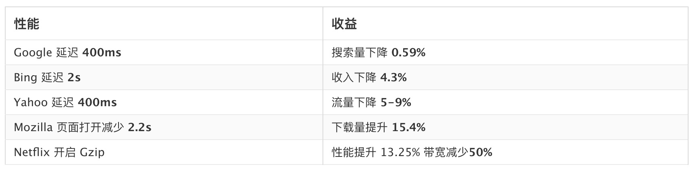
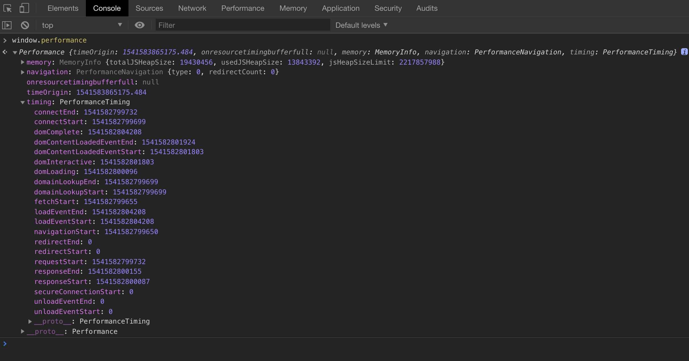
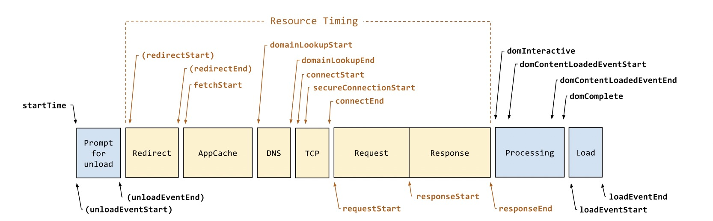
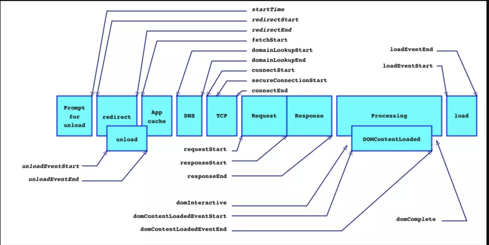
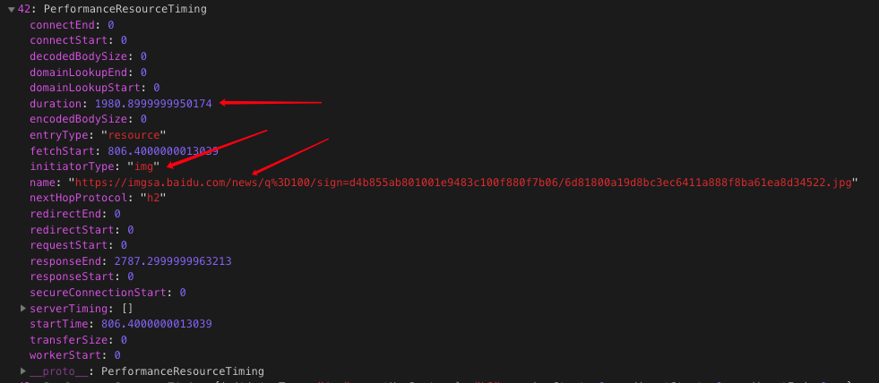
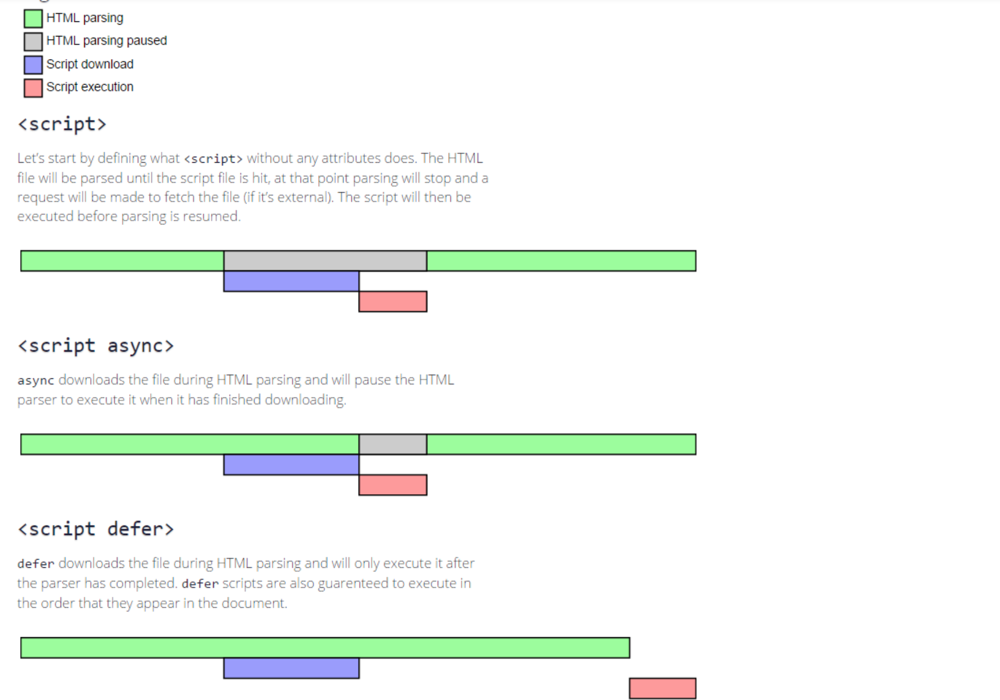

# 前端性能监控及前端性能优化

主要内容：
1. 前端性能监控系统 及 **如何做到性能监控**
2. **如何进行前端性能优化**

## 为什么要监控性能？

首先：因为性能直接影响了产品。对于用户来说，加载的延迟、操作的卡顿影响了用户体验

其次：对于公司来说，影响了公司利益

> 国外有很多这方面的调研数据：
> 

## 如何监控性能？
1. 利用测试工具
2. **在我们的页面中植入代码来监控（主要内容）**

### 1、利用测试工具
现在有很多优秀成熟的工具，下面简单介绍几个。

- [WebPagetest](https://www.webpagetest.org/) WebPageTest 是一款非常优秀的网页前端性能测试工具,已开源。可以使用在线版，也可以自己搭建。
- [Lighthouse - Google](https://developers.google.com/web/tools/lighthouse/#devtools) google开发的性能测试工具，有chrome插件、node CLI命令行。
- [PageSpeed Insights](https://developers.google.com/speed/pagespeed/insights/)  google的在线版测试工具。
- chrome控制台中的performance、audit。


优点：

>  **工具监控**不用将统计代码部署到页面中。
>
> 能够监控竞品的网页性能。

缺点：
> 工具模拟测试会在一定程度上与真实情况偏离，无法知道性能影响用户数
> 
> 采样少容易失真、无法监控复杂应用与细分功能。

### 2、植入代码监控

**代码监控**依托于js代码并部署到需监控的页面，手动计算时间差，或者利用web的`performance`接口获取到当前页面中与性能相关的信息。经过一些计算，就能得出我们想要的网页性能数据。

优点：

> 能够实时统计真实用户访问的性能数据。
>
> 能自定义监控业务功能，复杂应用。


## 需要采集哪些性能数据？
线上监控有哪些指标呢？如何更好地反映用户感知？

对于工程师来说，可能关注的是 DNS 查询、TCP 连接、dom渲染时间等指标。

我们根据用户的痛点，将浏览器加载过程抽取出如下几个关键指标：


- **白屏时间**：用户从打开页面开始到页面开始有东西呈现为止，这过程中占用的时间就是白屏时间，即用户首次看到内容的时间。

- **首屏时间**：英文称之为above the fold(首屏线之上)，用户在没有滚动时候看到的内容渲染完成并且可以交互的时间。

- **dom树构建时间**：指浏览器开始构建DOM树 到 DOM树构建完成的时间。

- **页面总加载时间**：页面所有资源都加载完成并呈现出来所花的时间。


## Performance介绍

`Performance` 接口可以获取到当前页面中与性能相关的信息。

我们可以使用 `performance` 提供的一组精确的数据，经过简单的计算就能得出一些网页性能数据。

先在chrome浏览器的控制台中输入`performance`看下出现内容。



### `Performance`属性

1.`performance.memory`其是 Chrome 添加的一个非标准扩展，描述基本内存使用情况。

```angular2html
window.performance.memory;
//memory对象格式
memory:{
    jsHeapSizeLimit:1136000000,// 内存大小限制
    totalJSHeapSize:11200000,// 可使用的内存
    usedJSHeapSize:10000000 // JS 对象（包括V8引擎内部对象）占用的内存，一定小于 totalJSHeapSize
}
```

2.`Performance.navigation` 这个对象表示出现在当前浏览上下文的 navigation 类型，比如加载还是刷新、发生了多少次重定向

```angular2html
//  哲学问题：我从哪里来？
navigation: {
    redirectCount: 0, // 如果有重定向的话，页面通过几次重定向跳转而来
    type: 0           // 0   即 TYPE_NAVIGATENEXT 正常进入的页面（非刷新、非重定向等）
                      // 1   即 TYPE_RELOAD       通过 window.location.reload() 刷新的页面
                      // 2   即 TYPE_BACK_FORWARD 通过浏览器的前进后退按钮进入的页面（历史记录）
                      // 255 即 TYPE_UNDEFINED    非以上方式进入的页面
}
```

3.`Performance.onresourcetimingbufferfull`是一个事件监听函数，当触发 resourcetimingbufferfull 事件的时候会被调用。
这个事件当浏览器的资源时间性能缓冲区已满时会触发。可以通过监听这一事件触发来预估页面crash（崩溃），统计页面crash概率，以便后期的性能优化。

4.`Performance.timeOrigin`: 性能测量开始时的时间的高精度时间戳。

5.**`Performance.timing`: 对象包含了各种与浏览器性能有关的时间数据，提供浏览器处理网页的各个阶段的耗时.**


先看下一个浏览器加载页面的整个过程中，各种环节的时间顺序：





> 这是一个典型的ssr项目的流程图，前后端分离的项目会多一个Resquest+Response的过程。


具体含义：

```js
timing: {
		// 在同一个浏览器上下文中，前一个网页（与当前页面不一定同域）unload 的时间戳
		// 如果无前一个网页 unload ，则与 fetchStart 值相等
        navigationStart：1542593674588
        
        // 如果前一个网页与当前网页属于同一个域名，则返回前一个网页的unload事件发生时的Unix毫秒时间戳。
        // 如果没有前一个网页，或者之前的网页跳转不是在同一个域名内，则返回值为0。
        unloadEventStart：0
        
        // 如果前一个网页与当前网页属于同一个域名，则返回前一个网页unload事件的回调函数结束时的Unix毫秒时间戳。
        // 如果没有前一个网页，或者之前的网页跳转不是在同一个域名内，则返回值为0。
        unloadEventEnd：0
        
        // 返回第一个HTTP跳转开始时的Unix毫秒时间戳。
        // 如果跳转都是同源的，则返回开始获取发起重定向的时间点，否则返回0
        redirectStart：0
        
        // 返回最后一个HTTP跳转结束时的Unix毫秒时间戳。
        // 如果没有跳转，或者跳转的不是同源的，则返回值为0。
        redirectEnd：0
           
        // 返回浏览器准备使用HTTP请求读取文档时的Unix毫秒时间戳。该事件在网页查询本地缓存之前发生。
        fetchStart：1542593674593
        
        // 返回域名查询开始时的Unix毫秒时间戳。如果使用持久连接，或者信息是从本地缓存获取的，则返回值等同于fetchStart属性的值。
        domainLookupStart：1542593674593
        
        // 返回域名查询结束时的Unix毫秒时间戳。如果使用持久连接，或者信息是从本地缓存获取的，则返回值等同于fetchStart属性的值。
        domainLookupEnd：1542593674593  
        
        // 返回HTTP请求开始向服务器发送时的Unix毫秒时间戳。如果使用持久连接（persistent connection），则返回值等同于fetchStart属性的值。
        connectStart：1542593674593        
        
        // 返回浏览器与服务器之间的连接建立时的Unix毫秒时间戳。如果建立的是持久连接，则返回值等同于fetchStart属性的值。连接建立指的是所有握手和认证过程全部结束。
        connectEnd：1542593674593
        
        // 返回浏览器与服务器开始安全链接的握手时的Unix毫秒时间戳。如果当前网页不要求安全连接，则返回0。
        secureConnectionStart：0
        
        // 返回浏览器向服务器发出HTTP请求时（或开始读取本地缓存时）的Unix毫秒时间戳。
        requestStart：1542593674593
       
       // 返回浏览器从服务器收到（或从本地缓存读取）最后一个字节时（如果在此之前HTTP连接已经关闭，则返回关闭时）的Unix毫秒时间戳。
        responseEnd：1542593674753
        
        // 开始解析渲染 DOM 树的时间
        domLoading：1542593674754    
        
        // 完成解析 DOM 树的时间
        domInteractive：1542593674979
        
        // DOM 解析完成后，网页内资源加载开始的时间
        // （当前网页DOMContentLoaded事件发生前的Unix毫秒时间戳。）
        domContentLoadedEventStart：1542593674981        
        
        // DOM 解析完成后，网页内资源加载完成的时间
        domContentLoadedEventEnd：1542593674981

        // DOM的解析器结束工作时的时间戳
        domComplete：1542593674982
        
        // 返回当前网页onload事件的回调函数开始时的Unix毫秒时间戳。如果该事件还没有发生，返回0。
        loadEventStart：1542593674982  
     
        // 返回当前网页onload事件的回调函数运行结束时的Unix毫秒时间戳。如果该事件还没有发生，返回0。     
        loadEventEnd：1542593674982
```

### 使用 performance.timing 信息简单计算出网页性能数据

```js
// 计算加载时间
function getPerformanceTiming () {  
    var performance = window.performance;
 
    if (!performance) {
        // 当前浏览器不支持
        console.log('你的浏览器不支持 performance 接口');
        return;
    }
 
    var t = performance.timing;
    var times = {};
 
    //【重要】页面加载完成的时间
    //【原因】这几乎代表了用户等待页面可用的时间
    times.loadPage = t.loadEventEnd - t.navigationStart;

    //【重要】解析 DOM 树结构的时间
    //【原因】反省下你的 DOM 树嵌套是不是太多了！
    times.domReady = t.domComplete - t.responseEnd;

    //【重要】重定向的时间
    //【原因】拒绝重定向！
    times.redirect = t.redirectEnd - t.redirectStart;

    //【重要】DNS 查询时间
    //【原因】DNS 预加载做了么？页面内是不是使用了太多不同的域名导致域名查询的时间太长？
    // 可使用 HTML5 Prefetch 预查询 DNS ，见：[HTML5 prefetch](http://segmentfault.com/a/1190000000633364)
    times.lookupDomain = t.domainLookupEnd - t.domainLookupStart;

    //【重要】读取页面第一个字节的时间
    //【原因】这可以理解为用户拿到你的资源占用的时间，加异地机房了么，加CDN 处理了么？加带宽了么？加 CPU 运算速度了么？
    // TTFB 即 Time To First Byte 的意思
    // 维基百科：https://en.wikipedia.org/wiki/Time_To_First_Byte
    times.ttfb = t.responseStart - t.navigationStart;

    //【重要】内容加载完成的时间
    //【原因】页面内容经过 gzip 压缩了么，静态资源 img/js 等压缩了么？
    times.request = t.responseEnd - t.requestStart;

    //【重要】执行 onload 回调函数的时间
    //【原因】是否太多不必要的操作都放到 onload 回调函数里执行了，考虑过延迟加载、按需加载的策略么？
    times.loadEvent = t.loadEventEnd - t.loadEventStart;

    // TCP 建立连接完成握手的时间
    times.TCPconnect = t.connectEnd - t.connectStart;
    
    //白屏时间
    times.whiteTime = t.domInteractive - t.navigationStart;

    return times;
}
```


### `Performance`方法

1.`performance.now()`

`performance.now`方法返回当前网页自从`performance.timing.navigationStart`到当前时间之间的微秒数（毫秒的千分之一）。也就是说，它的精度可以达到100万分之一秒。

```
performance.now() 
// 2372064.5999999833
```

通过两次调用performance.now方法，可以得到间隔的准确时间，用来衡量某种操作的耗时。

2.`performance.mark()`

可以使用 performance.mark() 标记各种时间戳。如：


`Performance.clearMarks()`方法用于清除标记，如果不加参数，就表示清除所有标记。

3.`performance.getEntries()`

使用performance.getEntries() 获取所有资源请求的时间数据，这个函数返回的将是一个数组，包含了页面中所有的 HTTP 请求

下面是其属性。

与 performance.timing 对比，没有了DOM相关的属性，新增了name, duration, entryType, initiatorType的属性

```angular2html
    // 资源名称，也是资源的绝对路径
    name: "http://cdn.alloyteam.com/wp-content/themes/alloyteam/style.css",
    // 资源类型
    entryType: "resource",
    // 谁发起的请求
    initiatorType: "link", // link 即 <link> 标签
                           // script 即 <script>
                           // redirect 即重定向
    // 加载时间
    duration: 18.13399999809917
 
```


4.`Performance.getEntriesByType()`

5.`Performance.getEntriesByName()`

## 使用示例

手写一个js监控插件，利用performance获取性能指标数据，并提交给后端。

示例见plugin的monitor.js文件。

## 分析展示性能数据

搭建一个性能监控的后台系统，统计各个项目的性能指标，便于我们分析自己项目的性能短板。

---

## 我们可以做哪些优化？

> [前端性能清单，让你的网站跑的更快](https://github.com/thedaviddias/Front-End-Performance-Checklist)  

1. HTML
2. CSS
3. Fonts
4. Images
5. JavaScript
6. Server
7. framework

#### 高优先级的: 

html
---

- [ ] **在JavaScript引用之前引用CSS：** 确保在使用JavaScript代码之前加载CSS。

    ```html
    <!-- 不推荐 -->
    <script src="jquery.js"></script>
    <script src="foo.js"></script>
    <link rel="stylesheet" href="foo.css"/>
    
    <!-- 推荐 -->
    <link rel="stylesheet" href="foo.css"/>
    <script src="jquery.js"></script>
    <script src="foo.js"></script>
    ```

    *为什么：*

    > js会阻塞浏览器，在引用js之前引用CSS可以实现更好地并行下载，从而加快浏览器的渲染速度。

    *怎么做：*

    > 确保css始终位于 script标签 之前。
    
    * 📖 [合理安排styles和scripts来提高网页速度](https://varvy.com/pagespeed/style-script-order.html)

- [ ] **最小化iframe的数量：** 仅在没有任何其他技术可行性时才使用iframe。尽量避免使用iframe。

- [ ] **DNS预取：** 一次 DNS 查询时间大概在60-120ms之间或者更长，提前解析网页中可能的网络连接域名
    ```html
     <link rel="dns-prefetch" href="http://example.com/">
    ```

css
---
- [ ] **压缩:** 所有CSS文件都需要被压缩，从生产文件中删除注释，空格和空行。

    *为什么：*
    > 缩小CSS文件后，内容加载速度更快，并且将更少的数据发送到客户端，所以在生产中缩小CSS文件是非常重要，这对用户是有益的，就像任何企业想要降低带宽成本和降低资源。

    *怎么做：*

    > 使用工具在构建或部署之前自动压缩文件。

- [ ] **非阻塞：** CSS文件需要非阻塞引入，以防止DOM花费更多时间才能渲染完成。

    ```html
    <link rel="preload" href="global.min.css" as="style">
    ```

    *为什么：*
    > CSS文件可以阻止页面加载并延迟页面呈现。使用`preload`实际上可以在浏览器开始显示页面内容之前加载CSS文件。**Preload**来告诉浏览器预先请求当前页需要的资源，从而提高这些资源的请求优先级。

    *怎么做：*

    > 需要添加`rel`属性并赋值`preload`，并在`<link>`元素上添加`as=“style”`。

- [ ] **避免在<body>中使用嵌入或内联CSS**

    *为什么：*

    > 它还可以提高代码的可维护性并使站点可访问性更强。

    *怎么做：*

    > 始终使用外部样式表或在`<head>`中嵌入CSS（并遵循其他CSS性能规则）。

- [ ] **分析css的复杂性：** 分析css有助于发现有问题的、冗余和重复的CSS选择器。

    *为什么：*
    > 有时在CSS中会出现冗余或验证错误，分析CSS文件并删除这些复杂性的代码可以加速CSS文件的读取和加载

    *怎么做：*
    > CSS需要有编写规范，再通过CSS预处理器处理。下面列出的一些在线工具也可以帮助你分析和更正你的代码。
    
    * 🛠 [TestMyCSS | 优化和检查CSS性能](http://www.testmycss.com/)
    * 📖 [CSS 统计数据（stats）](https://cssstats.com/)
    * 🛠 [macbre/analyze-css: CSS选择器复杂性和性能分析](https://github.com/macbre/analyze-css)

image
---
* [ ] **图像优化:** 在保证压缩后的图片符合产品要求的情况下将图像进行优化。

    *为什么：*
    > 优化的图像在浏览器中加载速度更快，消耗的数据更少。

    *怎么做：*

    > 尽可能尝试使用CSS3效果
    > 尽可能使用字体图片
    > 使用 SVG图片
    > 使用编译工具压缩。

* [ ] **图像格式：** 适当选择图像格式。

    *为什么：*

    > 确保图片不会减慢网站速度

    *怎么做：*

    > 使用[Lighthouse](https://developers.google.com/web/tools/lighthouse/)识别哪些图像可以使用下一代图片格式（如JPEG 2000m JPEG XR或WebP）。

javascript
---
- [ ] **JS 压缩:** 所有JavaScript文件都要被压缩，生产环境中删除注释、空格和空行。

    *为什么：*
    > 删除所有不必要的空格、注释和空行将减少JavaScript文件的大小，并加快网站的页面加载时间，提升用户体验。

    *怎么做：*

    > 建议使用下面的工具在构建或部署之前自动缩小文件。

* [ ] **非阻塞JavaScript：** 使用defer属性或使用async来异步加载JavaScript文件。

    ```html
    <!-- Defer Attribute -->
    <script defer src="foo.js"/>
    
    <!-- Async Attribute -->
    <script async src="foo.js"/>
    ```

    *为什么：*
> JavaScript阻止HTML文档的正常解析，因此当解析器到达`<script>`标记时（特别是在`<head>`内），它会停止解析并且执行脚本。如果您的脚本位于页面顶部，则强烈建议添加`async`和`defer`，但如果在`</body>`标记之前加载，没有太大影响。但是，使用这些属性来避免性能问题是一种很好的做法。

    *怎么做：*
    > 添加`async`或`defer`作为script脚本标记的属性。
    
    * 📖 [Remove Render-Blocking JavaScript](https://developers.google.com/speed/docs/insights/BlockingJS)
    * 📖 [Defer loading JavaScript](https://varvy.com/pagespeed/defer-loading-javascript.html)
    
    下面这张图解释了正常的script、async和defer加载流程。
    
    
    
    加载完script后会立即执行Async script，因此不保证执行顺序（最后引入的script可能在第一个script之前执行）
        
    defer script保证它们在页面中出现的执行顺序。

- [ ] **使用 tree shaking 技术减少 js 大小:** 通过构建工具分析 JavaScript 代码并移除生产环境中用不到的 js 模块或方法

    > tree shaking 是一个术语，指移除 JavaScript 上下文中的未引用代码
    
- [ ] **使用 code splitting 分包加载 js:** 通过分包加载，减少首次加载所需时间
  
    *怎么做：*
    > * **Vendor splitting** 根据库文件拆分模块，例如 React 或 lodash 单独打包成一个文件
    > * **Entry point splitting** 根据入口拆分模块，例如通过多页应用入口或者单页应用路由进行拆分
    > * **Dynamic splitting** 根据动态加载拆分模块，使用动态加载语法 ```import()``` ，实现模块按需加载

server
---

- [ ] **网站使用HTTPS:** 

    *Why:*

    > 如今的现代浏览器对于不安全的网站在许多功能上做了些限制。 例如：如果网站未使用HTTPS，则地理定位，推送通知和服务工作程序等功能会不起作用。

- [ ] **页面大小 < 1500 KB:** (理想情况 < 500 KB) 尽可能减少页面和资源的大小。

    *为什么：*
    > 提高最佳用户体验非常重要。

    *怎么做：*

    > 前端性能清单中的所有规则将帮助你尽可能地减少资源和代码。

- [ ] **页面加载时间 < 3秒：** 尽可能减少页面加载时间，以便快速将内容传递给用户。

    *为什么：*
    > 网站或应用程序速度越快，反弹增加的可能性越小，换句话说，失去用户或未来客户的机会就越少。Google对该主题的充分研究证明了这一点。

    *怎么做：*

    >  使用[Page Speed Insight](https://developers.google.com/speed/pagespeed/insights/)或[WebPageTest](https://www.webpagetest.org/)等在线工具分析可能会降低速度的工具，并使用前端性能清单来缩短加载时间。

- [ ] **TTFB < 1.3s:** 尽可能减少浏览器在接收数据之前等待的时间。

    * 📖 [什么是DevTools中的TTFB，以及如何处理它](https://scaleyourcode.com/blog/article/27)
    * 📖 [Monitoring your servers with free tools is easy](https://scaleyourcode.com/blog/article/7)
    * 📖 [Time to First Byte (TTFB)](https://varvy.com/pagespeed/ttfb.html)
    * 🛠 [Global latency testing tool](https://latency.apex.sh)

- [ ] **最小化HTTP请求：** 始终确保所请求的每个文件对网站或应用程序至关重要，尽可能减少http请求。

 * 📖 [Combine external CSS](https://varvy.com/pagespeed/combine-external-css.html)
 * 📖 [Combine external JavaScript](https://varvy.com/pagespeed/combine-external-javascript.html)

- [ ] **提供可访问的文件：** 避免请求无法访问的文件（404）。

- [ ] **正确设置HTTP缓存标头：** 合理设置HTTP缓存标头来减少http请求次数。

- [ ] **启用GZIP压缩** 使用压缩方法（如Gzip）来减小JavaScript文件的大小。使用较小尺寸的文件，用户可以更快地下载资源，从而提高性能。

- [ ] **减少页面重定向**  

---

#### 中优先级的: 
- [ ] **压缩 HTML:**  HTML代码压缩，将注释、空格和新行从生产文件中删除。
- [ ] **Concatenation:**  CSS文件合并。
- [ ] **使用`preconnect`可以更快地加载字体：** 

    ```html
    <link rel="preconnect" href="https://fonts.gstatic.com" crossorigin>
    ```
    *为什么：*

    > 浏览器必须连接DNS服务器并等待查找完成后再获取资源（字体，CSS文件...）。
    >
    > `prefetche`和`preconnect`允许浏览器在空闲时进行上面的操作，在真实请求时就不需要再花时间去做一系列动作。这带来了性能的提升。

- [ ] **使用矢量图像 VS 栅格/位图：**  可以的话，推荐使用矢量图像而不是位图图像。
* [ ] **懒加载：**  图像懒加载。
- [ ] **JavaScript 分析:**  检查JavaScript文件（以及CSS）中的性能问题。
- [ ] **使用CDN存放资源资源：**  由于浏览器同一域名并行下载数有限，利用多域名主机存放静态资源，增加并行下载数，缩短资源加载时间

---

#### 低优先级的: 
- [ ] **删除不必要的属性：**  像 `type="text/javascript"` or `type="text/css"` 这样的属性应该被移除。
    *为什么*

    > 类型属性不是必需的，因为HTML5把text/css和text/javascript作为默认值。没用的代码应在网站或应用程序中删除，因为它们会使网页体积增大。

- [ ] **删除不必要的注释：**
    *为什么：*
    > 注释对用户来说是没有用的，应该从生产环境文件中删除。可能需要保留注释的一种情况是：保留远端代码库（keep the origin for a library）。

    *怎么做：*

    > 大多数情况下，可以使用HTML minify插件删除注释。

- [ ] **检查依赖项大小限制：** 确保使用最优的外部库，大多数情况下，可以使用更轻的库来实现相同的功能。

    *为什么：*
    > 例如，MomentJS是一个很棒的库，但是你可能永远不会使用其中的很多方法，这就是为什么创建Day.js的原因。瞬间大小从16.4kB到2kB。

    *怎么做：*

    > 始终比较并选择最适合您需求的轻型库。还可以使用[npm trends](https://www.npmtrends.com/momentjs-vs-dayjs)
---

## 参考链接：

[前端性能清单，让你的网站跑的更快](https://github.com/thedaviddias/Front-End-Performance-Checklist)  

[FEX周刊](http://fex.baidu.com/blog/2014/05/build-performance-monitor-in-7-days/)

[MDN-performance文档](https://developer.mozilla.org/zh-CN/docs/Web/API/Window/performance)

[初探performance](http://www.alloyteam.com/2015/09/explore-performance/)

[掘金：前端性能监控](https://juejin.im/entry/58ba9cb5128fe100643da2cc)
