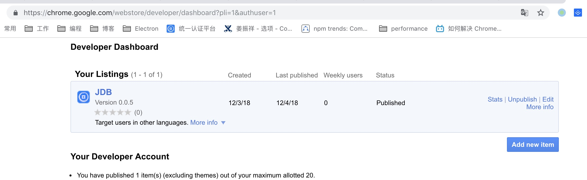
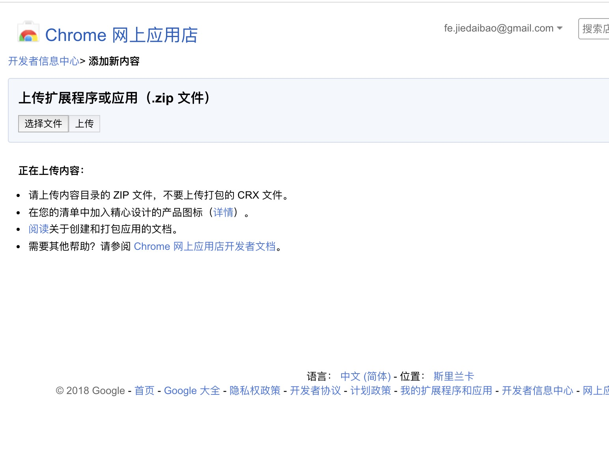
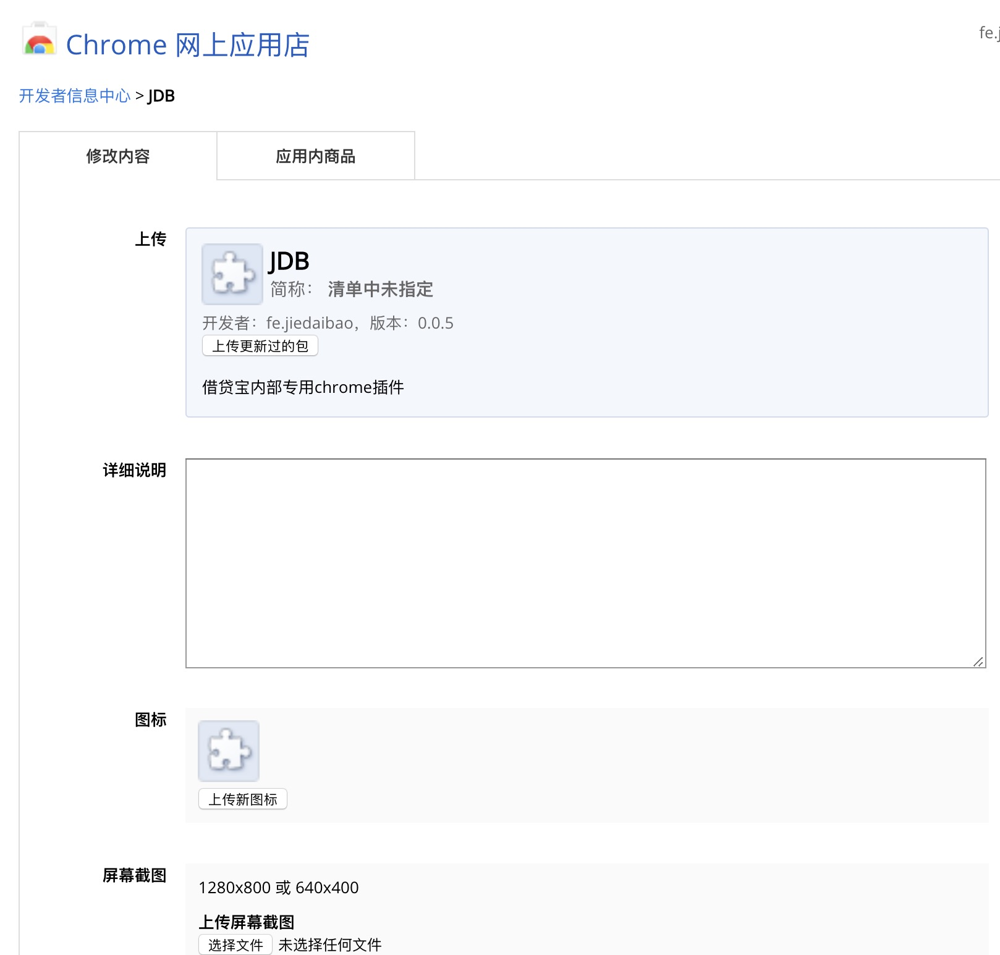

# chrome扩展程序开发

介绍如何进行chrome插件开发，打包，上传chrome应用商店，更新，安装的开发流程。
> 相关项目：借贷宝内部考勤系统报销插件 [http://git.jdb-dev.com/pluto/jdbChrome](http://git.jdb-dev.com/pluto/jdbChrome)

## 什么是chrome插件

chrome插件是基于chrome浏览器的扩展程序，可为Chrome添加新的实用功能。。它们基于HTML、JavaScript和CSS等web技术开发。

## 开始开发一个扩展程序

### 1、创建一个`manifest.json`文件。

首先创建一个文件夹用于保存扩展文件，然后创建一个`manifest.json`文件。

每个扩展程序都应有一个`manifest.json`文件，提供有关扩展程序的各种信息。

```js
  {
    "name": "Hello Extensions",
    "version": "1.0",
    "description": "Build an Extension!",
    "manifest_version": 2
  }
```

在开发模式下，加载扩展程序。
> 1、打开[chrome://extensions/](chrome://extensions/)
>
> 2、打开右上角的`开发者模式`开关
>
> 3、点击`加载已解压的扩展程序`，然后选择刚刚的文件夹，就能成功添加插件
>
> 因为我们还没有写入功能代码，所以这个插件目前还没有任何功能

### 2、添加命令

`background`：通过manifest.json中的`background`字段添加后台脚本，可以告诉扩展程序要引用哪个文件，以及该文件应该如何表现。扩展程序通过后台脚本监视浏览器事件。

*扩展程序是基于事件的程序，而事件是浏览器的触发器，例如导航到新页面、移除书签、关闭选项卡。*

> 引入方式：

```js
"background": {
    "scripts": [
        "background.js"
    ],
    "persistent": false // 是否保持后台脚本持久活动。persistent一般应指定为false
}
```

>background.js文件

```js
// 当扩展第一次安装时触发监听事件。
chrome.runtime.onInstalled.addListener(function() {
    // 使用storage api同步存储一个数据。
    chrome.storage.sync.set({color: '#3aa757'}, function() {
        console.log("The color is green.");
    });
});
```

使用大多数API时，需要在manifest.json的`permissions`字段注册权限才能使用。`storage`也需要注册。如下：

### 3、添加插件权限
```js
"permissions": [
    "storage"
]
```
要使用chrome.* API，必须在清单文件的 "permissions" 字段中声明。

### 4、添加一个用户界面

扩展可以有多种形式的用户界面，这次我们以弹窗为例。开发一个扩展，使用一个按钮来改变页面的背景颜色。

创建并添加一个名为`popup.html`。
```html
  <!DOCTYPE html>
  <html>
    <head>
      <style>
        button {
          height: 30px;
          width: 30px;
          outline: none;
        }
      </style>
    </head>
    <body>
      <button id="changeColor"></button>
    </body>
  </html>
```

然后在 manifest.json中使用 `page_action`声明弹窗文件为 `popup.html`

```json
  {
    "name": "Getting Started Example",
    "version": "1.0",
    "description": "Build an Extension!",
    "permissions": ["storage"],
    "background": {
      "scripts": ["background.js"],
      "persistent": false
    },
    "page_action": {
      "default_popup": "popup.html",
    },
    "manifest_version": 2
  }
```

设置工具栏图标

```json
"page_action": {
  "default_popup": "popup.html",
  "default_icon": {
    "16": "images/get_started16.png",
    "32": "images/get_started32.png",
    "48": "images/get_started48.png",
    "128": "images/get_started128.png"
  }
},

```

设置扩展程序在 chrome://extensions页的图标

```json
{
    "name": "Getting Started Example",
    "version": "1.0",
    "description": "Build an Extension!",
    "permissions": ["storage"],
    "background": {
      "scripts": ["background.js"],
      "persistent": false
    },
    "page_action": {
      "default_popup": "popup.html",
      "default_icon": {
        "16": "images/get_started16.png",
        "32": "images/get_started32.png",
        "48": "images/get_started48.png",
        "128": "images/get_started128.png"
      }
    },
    "icons": {
      "16": "images/get_started16.png",
      "32": "images/get_started32.png",
      "48": "images/get_started48.png",
      "128": "images/get_started128.png"
    },
    "manifest_version": 2
  }
```

这时重新加载一下此扩展程序，工具栏会有一个置灰的按钮，没有任何功能。下面写一下功能，告诉浏览器何时弹出弹窗popup.html。

在background.js中使用declarativeContent API添加规则。

```js
// background.js
  chrome.runtime.onInstalled.addListener(function() {
    chrome.storage.sync.set({color: '#3aa757'}, function() {
      console.log('The color is green.');
    });
    chrome.declarativeContent.onPageChanged.removeRules(undefined, function() {
      chrome.declarativeContent.onPageChanged.addRules([{
        // 条件：根据域名匹配页面
        conditions: [new chrome.declarativeContent.PageStateMatcher({
          pageUrl: {hostEquals: 'developer.chrome.com'},
        })
        ],
        // 满足条件时展示page action
        actions: [new chrome.declarativeContent.ShowPageAction()]
      }]);
    });
  });
```
还需要在manifest.json中添加declarativeContent权限： 
`"permissions": ["declarativeContent", "storage"]`

重新加载扩展，打开 developer.chrome.com页面，右上角的插件图标变成可用状态。点击弹出弹窗。

最后一步：添加`popup.js`，修改弹窗的颜色
```js
  let changeColor = document.getElementById('changeColor');

  chrome.storage.sync.get('color', function(data) {
    changeColor.style.backgroundColor = data.color;
    changeColor.setAttribute('value', data.color);
  });
```
然后在`popup.html`中引入js。重新加载扩展就能看的绿色按钮。

### 5、添加逻辑。点击按钮改变页面背景颜色。
```js
// 在popup.js中添加如下代码。
changeColor.onclick = function(element) {
    let color = element.target.value;
    // 获取当前选项卡  active：当前tab是否激活 。
    // currentWindow：选项卡是否在当前窗口。
    
    // window是指chrome窗口，tab是指chrome的选项卡。
    // 如Cmd+N就是打开一个新的window，cmd+T就是打开一个新的Tab
    chrome.tabs.query({active: true, currentWindow: true}, function(tabs) {
      // 想这个页面注入下面code代码
      chrome.tabs.executeScript(
          tabs[0].id,
          {code: 'document.body.style.backgroundColor = "' + color + '";'});
    });
};
```
在manifest.json中添加activeTab权限。

现在扩展的功能就完成了。

### 6、添加扩展程序选项
`扩展程序页 -> 详情信息 -> 扩展程序选项`

现在扩展只能把背景改为绿色。添加选项页，用户可以自定义扩展的功能。

新建 `option.html`
```html
<!DOCTYPE html>
  <html>
    <head>
      <style>
        button {
          height: 30px;
          width: 30px;
          outline: none;
          margin: 10px;
        }
      </style>
    </head>
    <body>
      <div id="buttonDiv">
      </div>
      <div>
        <p>Choose a different background color!</p>
      </div>
    </body>
    <script src="options.js"></script>
  </html>
```

在manifest中注册`option page`
```json
  {
    "name": "Getting Started Example",
    ...
    "options_page": "options.html",
    ...
    "manifest_version": 2
  }
```

重新加载，就会有扩展程序选项了。

然后添加一写逻辑，新建options.js

```js
let page = document.getElementById('buttonDiv');
  const kButtonColors = ['#3aa757', '#e8453c', '#f9bb2d', '#4688f1'];
  function constructOptions(kButtonColors) {
    for (let item of kButtonColors) {
      let button = document.createElement('button');
      button.style.backgroundColor = item;
      // 单击按钮时，它将更新扩展的全局存储中的颜色值。
      button.addEventListener('click', function() {
        chrome.storage.sync.set({color: item}, function() {
          console.log('color is ' + item);
        })
      });
      page.appendChild(button);
    }
  }
  constructOptions(kButtonColors);
```

到这里插件就完成了。

### 7、加载扩展程序
在chrome浏览器中打开 chrome://extensions/，打开开发者模式，点击加载已解压的扩展程序，选择文件所在文件夹，就能将我们的代码加载到浏览器中生成扩展程序。

### 8、打包扩展程序

在chrome浏览器中打开 chrome://extensions/，打开开发者模式，点击打包扩展程序，然后选择文件所在文件夹，点击打包就生成 `.crx`扩展程序文件 和 `.pem`秘钥文件。

> 通常不需要打包扩展程序。如果使用 Chrome 开发者信息中心发布扩展程序，那么不需要创建自己的 .crx 文件，除非需要发布一个非公开版本，例如用于测试人员。

秘钥文件用于：
1. 更新扩展程序
2. 将扩展程序上传至 Chrome 网上应用店

### 9、上传至chrome应用商店

1）进入[Chrome开发者信息中心](https://chrome.google.com/webstore/developer/dashboard)，登录账户，点击 **Add new item**添加新应用。

2）上传扩展程序的压缩文件（zip文件）

3）修改扩展内容，如详细说明，图标，屏幕截图，类型，价格，语言等

4）填写完整后，点击发布按钮发布完成。

---

## 更多manifest.json的信息。

```js
{
  //  一个整数，指定程序包所需的清单文件格式的版本。 从Chrome 18开始，开发人员应设置为2。
  "manifest_version": 2,
  // 扩展的名称。扩展的主要标识符
  "name": "My Extension",
  // 版本号
  "version": "0.0.4",
  
  // 默认地区语言。指定_locales其子目录。例如 _locales/en 的目录中存放的是英语的信息
  "default_locale": "en", 
  // 描述， 适用于与chrome应用商店的描述
  "description": "A plain text description",
  // 扩展的图标有三种，128*128用在chrome应用商店和安装后，48*48用在扩展管理页，16*16扩展页的favicon。
  "icons": {
       "16": "icon16.png",
       "48": "icon48.png",
       "128": "icon128.png" 
  },
  
   // 代表以浏览器按钮的形式放在浏览器右上角的工具栏中。浏览器打开时便是启用状态
  "browser_action": {
      "default_icon": {
          "16": "images/icon16.png",
          "24": "images/icon24.png",
          "32": "images/icon32.png"
        },
        // 鼠标悬浮带插件上时的提示
        "default_title": "Google Mail",      
        // 设置弹出内容，当用户单击图标时会出现弹出内容。
        "default_popup": "popup.html"        
  },
   // 代表以页面按钮的形式放在浏览器右上角的工具栏中。必需在指定的条件符合的状况才会启用
  "page_action": {...},

  "author": ...,
  // 事件是浏览器触发器，例如导航到新页面，关闭选项卡。 使用后台脚本中监视这些事件。
  // 可以通过background指定一个background.js文件（后台脚本）
  "background": {
      "scripts": [
              "background.js"
          ],
      // 是否保持后台脚本持久活动。persistent一般应指定为false
      // 唯一是true的场合是扩展使用chrome.webRequest API来阻止或修改网络请求。webRequest API与非持久性后台页面不兼容
      "persistent": true
  },
  // 复写chrome设置，如主页，搜索引擎，开始页
  "chrome_settings_overrides": {
      "homepage": "http://www.homepage.com",
      "search_provider": {
          "search_url": "http://www.foo.__MSG_url_domain__/s?q={searchTerms}",
      },
      "startup_pages": ["http://www.startup.com"]
  },
  // 修改chrome ui界面，如隐藏书签栏
  "chrome_ui_overrides" : {
    "bookmarks_ui": {
      "remove_button": "true",
      "remove_bookmark_shortcut": "true"
    }
  },
  // 替换chrome的某些页面，如新选项卡页，历史记录页书签管理页
  "chrome_url_overrides": {...},
  // 使用命令API添加触发扩展中操作的键盘快捷键，例如，MacCtrl+Shift+F 打开扩展。
  "commands": {
      "_execute_browser_action": {
          "suggested_key": {
              "default": "Ctrl+Shift+F",
              "mac": "MacCtrl+Shift+F"
          },
          "description": "Opens hello.html"
      }
  }
   // 需要直接注入页面的JS，在页面中运行的js
  "content_scripts": [{
      // 以声明方式注入js，会在指定的页面自定执行js
      "matches": ["http://e-hr.jiedaibao.com/kaoqin/*"],
      "js": [
          "jquery-3.2.1.min.js",
          "main.js"
      ],
      "css": ["my.css"]
  }],
  // DevTools扩展程序为Chrome DevTools添加了功能。如React Developer Tools
  "devtools_page": "devtools.html",
   // 本扩展的主页地址
  "homepage_url": "http://path/to/homepage",
   // 所需要的chrome版本
  "minimum_chrome_version": "versionString",
   // 设置离线状态是否可用
  "offline_enabled": true,
   // 为了使用chrome的一些api，需要在声明权限
  "permissions": ["tabs"],
   // 指定本扩展在注入的目标页面上所需使用的资源的路径（相对于扩展的安装根目录）
  "web_accessible_resources": [
        "images/my-awesome-image1.png",
        "images/my-amazing-icon1.png",
        "style/double-rainbow.css",
        "script/double-rainbow.js"
  ],
  // 向地址栏注册一个关键字以提供搜索建议，只能设置一个关键字
    "omnibox": { "keyword" : "go" },
  // 扩展程序选项页
  "options_page": "options.html",
  // 普通页面能够直接访问的插件资源列表，如果不设置是无法直接访问的
  // var s = document.createElement('script'); s.src = chrome.extension.getURL('script.js');
  "web_accessible_resources": [
    "images/*.png",
    "style/double-rainbow.css",
    "script/double-rainbow.js",
    "script/main.js",
    "templates/*"
  ],
}
```

### 参考
[官网文档](https://developer.chrome.com/extensions/getstarted)、[翻译文档](https://crxdoc-zh.appspot.com/extensions/overview)(比较落后)
[使用react开发chrome插件](http://web.jobbole.com/94893/)
[示例demo](https://developer.chrome.com/extensions/samples)
