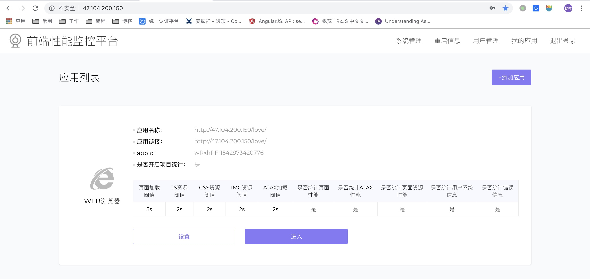
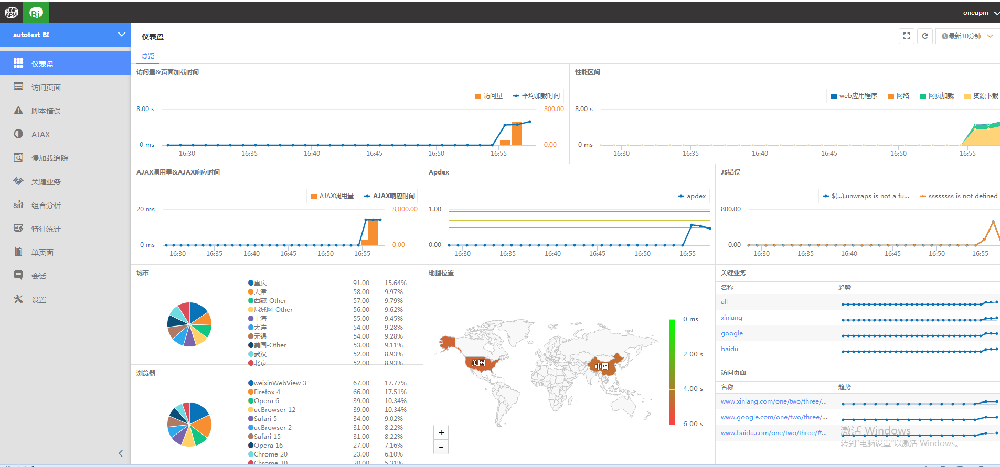
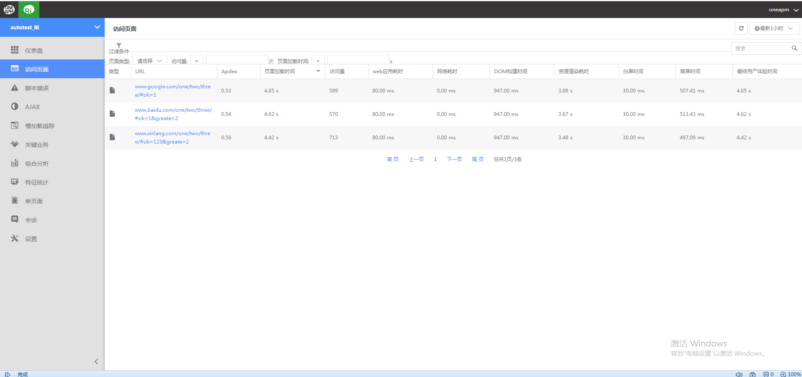
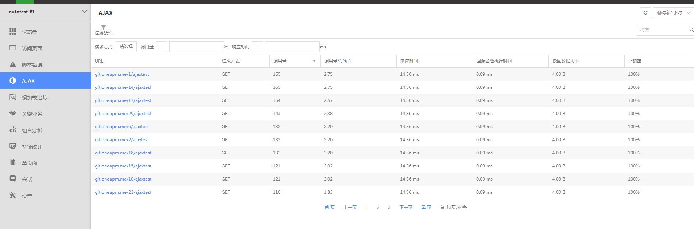
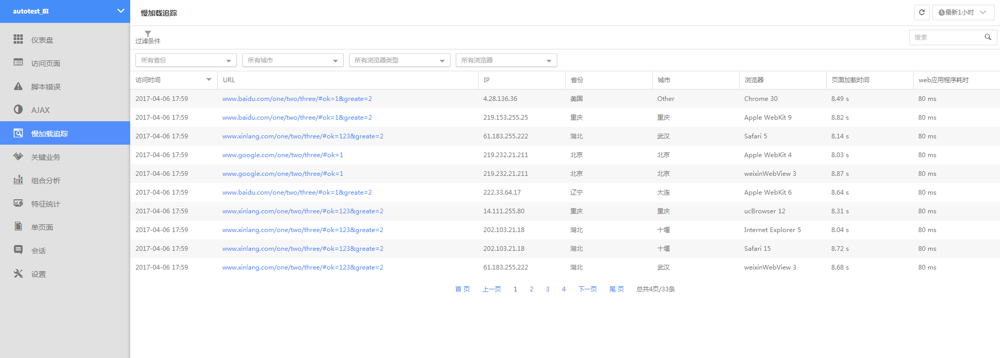

# 自研需求-前端性能监控系统

## 1、项目背景

为提高用户体验，优化前端性能，打造一个前端性能监控系统。

[前端性能监控系统分享](http://git.jdb-dev.com/FECentre/feShare/blob/master/FE-Performance/README.md) 

## 2、项目目标

1、**web端性能数据上报sdk**：用户在其页面中引入sdk，可以将其web页面性能、资源请求性能等数据上报给后端。

2、**后台系统**：用户可以在后台添加想要监控的页面应用；收集统计上报的性能数据。

## 3、功能需求
890-
### 3.1 web端用户数据上报sdk

功能描述：

- 页面级的性能上报
- 页面AJAX、fetch性能上报
- 页面所有加载资源性能上报（图片,js,css）

---

SDK主要上报一下性能信息：

- preUrl 来访上一页面URL
- performance 页面性能数据详情，字段含义详情请参考后面内容
- resoruceList 页面性能数据详情，当前页面所有资源性能详情信息，字段含义详情请参考后面内容
- markUv 统计uv标识
- markUser 从用户进入网站开始标识，直到用户离开销毁，可以用来做用户漏斗分析
- time 当前上报时间
- screenwidth 屏幕宽度
- screenheight 屏幕高度

---

单页面应用上报：

- 单页面应用主要资源只会加载一次，因此插件只统计第一次进入页面的资源性能详情。
- 路由切换时只上报按需加载的资源信息和请求的页面ajax信息，触发条件为此页面是否有ajax，有则触发，无则不触发。
  
---

引入方式：

1、 HTML页面直接引用资源方式
> 1. 下载 dist/web-report-default.min.js 到本地
> 2. 使用script标签引入到html的头部（备注：放到所有js资源之前）
> 3. 使用performance函数进行数据的监听上报
> 
```html
<html>
  <head>
  <meta charset="UTF-8">
  <title>performance test</title>
  <script src="../dist/web-report-default.min.js"></script>
  <script>
    Performance({
        domain:'http://some.com/api', //Your API address
    })
  </script>
</head>
```

2、 npm引入方式
> 
```javascript
    //通用版本引入
    import Performance from 'web-report';

    Performance({
        domain:'http://some.com/api', //Your API address
    })
```

---

传参说明

- domain：后台上报api接口
- outtime： 上报延时时间，保证异步数据的加载（默认值：？）
- isPage：是否上报页面性能数据（默认：true）
- isResource：是否上报页面资源性能数据（默认：true）
- isAjax ：是否上报ajax信息 （默认：true）
- add：附带参数 （值为json object 例如：{APPID:'123456789'}）
---


### 3.2 后台系统

1、 用户登录注册

2、 用户根据网页地址创建一个后台应用。



3、 进入网页应用可以查看页面数据统计分析。

- 仪表盘 (总览信息)

    > 
- 页面性能

    > 
- AJAX性能

    > 
- 慢加载追踪（当页面访问页面时，页面加载时间大于一定的阈值，就会记录这次发生缓慢的详情）

    > 
- 慢资源追踪
- 系统设置
    appid； 部署说明； 慢加载阈值设置； 统计设置；删除数据；
___


参考：https://github.com/wangweianger/web-report-sdk

https://www.oneapm.com/bi/feature.html
